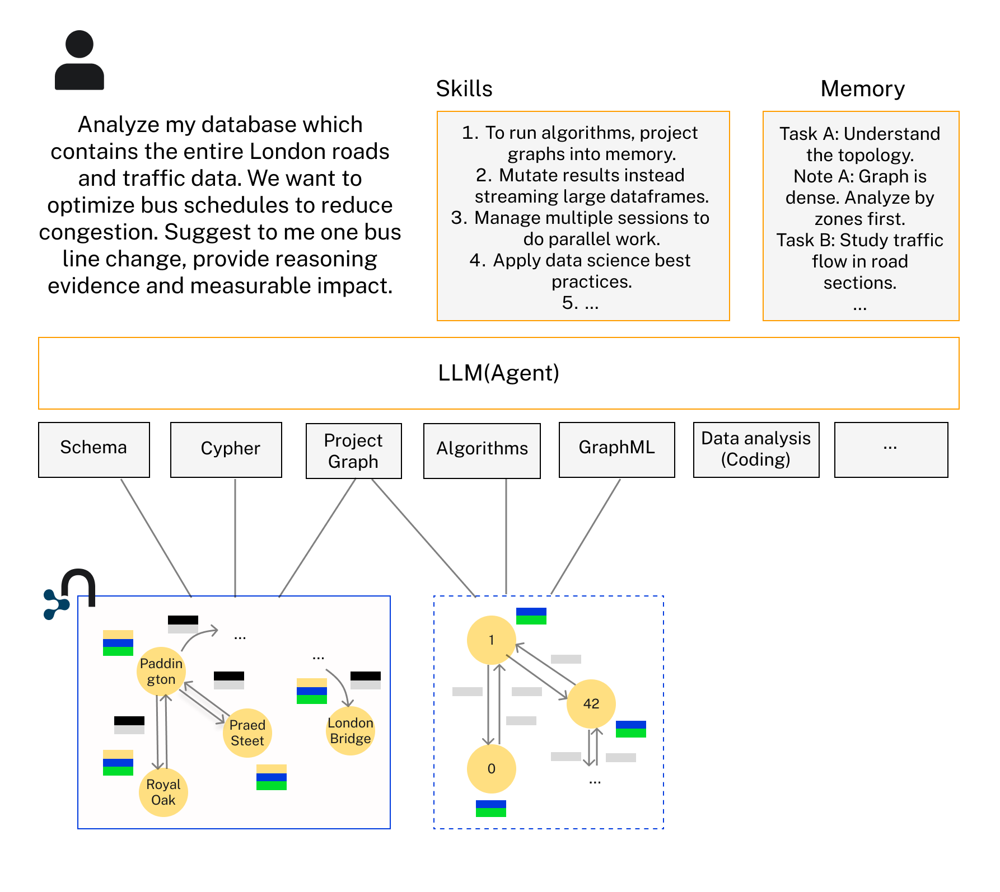

# GDS Agent

The GDS Agent let LLMs reason and do data science work on your graph data in Neo4j, by using two artifacts:

- **Tools** — an MCP server exposing Neo4j Graph Data Science (GDS) algorithms: centrality, community detection, path finding, similarity, node embeddings, and ML pipelines.
- **Skills** — an agent skill (`neo4j-graph-data-scientist`) teaching the agent how and when to use those tools and best practices for doing data science on graphs.

It works with any MCP-capable harness — Claude Code, Claude Desktop, claude.ai, OpenAI Codex, Cursor, VS Code/Copilot, Gemini CLI — and programmatically from agent frameworks. It uses the GDS plugin on self-managed Neo4j and GDS Aura Graph Analytics sessions on AuraDB, over STDIO or HTTP transport.

Once set up, you can **ask any graph question about your Neo4j graph** and get answers. You can collaborate with the agent as a graph data scientist to solve complex tasks. 



# Install


| Harness               | Tools (MCP)                                                                                             | Skill                                               | Guide                                |
| --------------------- | ------------------------------------------------------------------------------------------------------- | --------------------------------------------------- | ------------------------------------ |
| **Claude Code**       | `/plugin marketplace add neo4j-contrib/gds-agent` → `/plugin install gds-agent@neo4j-gds`               | bundled with the plugin                             | [setup](doc/setup/claude-code.md)    |
| **Claude Desktop**    | download the `.mcpb` from [releases](https://github.com/neo4j-contrib/gds-agent/releases), double-click | upload the skill zip in Settings → Skills           | [setup](doc/setup/claude-desktop.md) |
| **OpenAI Codex**      | `codex mcp add neo4j-gds -- uvx gds-agent`                                                              | `npx skills add neo4j-contrib/gds-agent -a codex`   | [setup](doc/setup/codex.md)          |
| **Cursor**            | one-click badge                                                                                         | `npx skills add neo4j-contrib/gds-agent -a cursor`  | [setup](doc/setup/cursor.md)         |
| **VS Code / Copilot** | one-click badge or `.vscode/mcp.json`                                                                   | `npx skills add neo4j-contrib/gds-agent -a copilot` | [setup](doc/setup/vscode.md)         |
| **Gemini CLI**        | `gemini extensions install https://github.com/neo4j-contrib/gds-agent`                                  | bundled with the extension                          | [setup](doc/setup/gemini-cli.md)     |
| **Your own agent**    | any MCP client (stdio/HTTP)                                                                             | inject SKILL.md as instructions                     | [setup](doc/setup/programmatic.md)   |


Most local setups need [uv](https://docs.astral.sh/uv/getting-started/installation/) installed (the server runs via `uvx gds-agent` from PyPI). Generic MCP clients run `uvx gds-agent` over stdio with the environment variables below.

## Configuration reference

Set as environment variables (or the credential form of your harness's installer):


| Variable                                               | Required     | Purpose                                             |
| ------------------------------------------------------ | ------------ | --------------------------------------------------- |
| `NEO4J_URI`                                            | yes          | `neo4j://` or `neo4j+s://` connection URI           |
| `NEO4J_USERNAME` / `NEO4J_PASSWORD`                    | yes          | database credentials                                |
| `NEO4J_DATABASE`                                       | no           | database name (defaults to `neo4j`)                 |
| `AURA_API_CLIENT_ID` / `AURA_API_CLIENT_SECRET`        | session mode | Aura API credentials for Aura Graph Analytics       |
| `AURA_API_PROJECT_ID`                                  | no           | only if the API client can access multiple projects |
| `SESSION_MEMORY_GB` / `SESSION_TTL_HOURS`              | no           | session defaults (8 GB / 24 h)                      |
| `GDS_AGENT_MAX_RESULT_ROWS` / `_CHARS` / `_CELL_CHARS` | no           | tool output limits (500 / 100000 / 200)             |


By default the server uses STDIO transport for local MCP clients. For HTTP-native clients, run the server with streamable HTTP:

```bash
gds-agent --transport http --host 127.0.0.1 --port 8000 --path /mcp
```

The equivalent environment variables are `GDS_AGENT_TRANSPORT`, `GDS_AGENT_HOST`, `GDS_AGENT_PORT`, and `GDS_AGENT_PATH`. The Neo4j MCP-style `NEO4J_TRANSPORT` and `NEO4J_MCP_SERVER_*` names are also supported.

## GDS Aura Graph Analytics (sessions)

The server detects whether the connected Neo4j has the GDS plugin installed or whether to use a GDS Aura Graph Analytics session. Detection runs `gds.session.list()` on startup; if it succeeds, session mode is used and graph projections fall back to `gds.graph.project.remote`.

Session mode requires Aura API credentials (see the configuration reference above) in the same `.env` file or `env` block as the database credentials.
Sessions are managed explicitly by the agent: three extra tools become available in session mode (`list_sessions`, `create_session`, and `delete_session`). A session must first be created with `create_session`, `project_graph_cypher` then projects each graph into the session named by its required `sessionName` parameter, and algorithm calls are routed to the right session automatically by `graphName`. Most workflows need a single session holding all graphs; multiple sessions allow running analyses in parallel. To resize a session (e.g. after an OOM), delete it and create it again with a larger `memoryGB`. All sessions created by the server are named with an `mcp_` prefix. Aura sessions are charged separate to the DB.

# The skill

`[skills/neo4j-graph-data-scientist](skills/neo4j-graph-data-scientist/SKILL.md)` is consumed from this one location by the Claude Code plugin, the Gemini extension, `npx skills`, and the release skill zip. It covers GDS-specific workflow best practices with a [troubleshooting](skills/neo4j-graph-data-scientist/references/troubleshooting.md) reference guide, as well as general data science best practices. It is designed for the gds-agent and mcp-neo4j-cypher MCP servers.

# Read-only Cypher alongside GDS

The GDS server deliberately executes no arbitrary Cypher — its only Cypher entry point is graph projection. To let the agent also read the underlying data (inspect properties, aggregate, verify algorithm results), pair it with the `[mcp-neo4j-cypher](https://github.com/neo4j-contrib/mcp-neo4j)` server in read-only mode.

The **Claude Code plugin** and the **Gemini CLI extension** already bundle it: one install configures both servers with the same credentials, and `NEO4J_READ_ONLY=true` removes its write tool. On any other harness, register a second server alongside gds-agent:

```json
"neo4j-cypher": {
  "command": "uvx",
  "args": ["mcp-neo4j-cypher@0.6.0", "--transport", "stdio"],
  "env": {
    "NEO4J_URI": "neo4j://localhost:7687",
    "NEO4J_USERNAME": "neo4j",
    "NEO4J_PASSWORD": "<your-password>",
    "NEO4J_READ_ONLY": "true"
  }
}
```


# Example dataset

To load a London underground example dataset:

1. Fork and clone the repository
2. Install the Neo4j database with GDS plugin:
  Download the Neo4j Desktop from [Neo4j Download Center](https://neo4j.com/download/)
   Install the GDS plugin from the Neo4j Desktop
   Create a new database and start it
3. Populate .env file with necessary credentials:
  ```bash
   NEO4J_URI=bolt://localhost:7687  # or your database URI
   NEO4J_USERNAME=neo4j  # or your db username
   NEO4J_PASSWORD=your_password
  ```
4. Load the London Underground dataset with the following command ([uv](https://docs.astral.sh/uv/getting-started/installation/) resolves the script's dependencies automatically):
  ```bash
   uv run import_data.py --undirected
  ```
   Alternatively, `pip install -r requirements.txt` and run `python import_data.py --undirected`.

Connect to your DB and querying the graph from [Neo4j workspace](https://workspace-preview.neo4j.io/workspace/), 
you should see:
London Underground Graph

# Start the server for dev

1. When inside the `/mcp_server` directory, run `uv sync --dev` and run `uv run gds-agent` to start the MCP server standalone, or run `claude` to start claude-cli with the agent.
2. To try the plugin (MCP server + skill) from your working tree: `claude --plugin-dir .` from the repository root.


# Releases

Version numbers are kept in lockstep across `pyproject.toml` and all distribution manifests by `scripts/bump_version.py`. Pushing a `v*` tag triggers the release workflow.

# How to contribute

Open a pull request from a branch of your forked repository into the main branch of this repo, for example `mygithubid:add-new-algo -> neo4j-contrib:main`.

The CI build in github action requires all codestyle checks and tests to pass.

To run and fix codestyle checks locally, in the `/mcp_server` directory, run:

```bash
uv sync --dev
```

to setup the python environment. And then,

```bash
uv run pytest tests -v -s
uv run ruff check
uv run ruff format
```

for all tests and codestyle fixes.

# Feature request and bug reports

To report a bug or a new feature request, raise an issue.
If it is a bug, include the full stacktrace and errors.
When available, attach relevant logs in `mcp_server_neo4j_gds.log`. This file is located inside the `/mcp_server/src_mcp_server_neo4j_gds` directory if the gds agent is running from source, or inside the logging path for Claude (e.g `/Library/Logs/Claude` for Claude Desktop on Mac). Include relevant minimal dataset that can be used to reproduce the issue if possible.

# Additional resources

The GDS agent can be used with other MCP servers, such as those that provide additional Neo4j toolings: [https://github.com/neo4j-contrib/mcp-neo4j](https://github.com/neo4j-contrib/mcp-neo4j)
Arxiv paper including details about the architecture and benchmark results: [https://arxiv.org/abs/2508.20637](https://arxiv.org/abs/2508.20637).